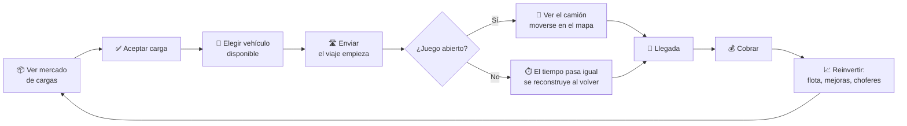
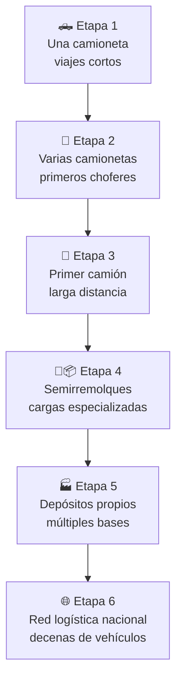

<div align="center">

# 🚚 Por la Ruta

### *Empezás con una camioneta. Terminás administrando una red logística nacional.*

</div>

---

## 📖 El pitch

> Sos el dueño de una empresa de transporte terrestre en Argentina. No manejás vos: contratás choferes, comprás vehículos, aceptás cargas y observás — en un mapa real, con rutas reales — cómo tu flota recorre el país. Cerrás el juego, la operación sigue. Volvés más tarde a cobrar, reinvertir, y mandar la próxima camioneta un poco más lejos que la anterior.

Un **management / logistics tycoon** de progresión idle, ambientado 100% en Argentina, con un mapa real donde los vehículos se desplazan siguiendo la geometría real de calles, autopistas y rutas nacionales — no un simulador de conducción, no un mundo 3D, no control manual.

---

## 🧭 Fantasía central

| | |
|---|---|
| **Quién sos** | El dueño/gerente de una empresa de transporte, no el chofer |
| **Qué hacés** | Decidís: qué carga aceptar, qué vehículo mandar, cuándo crecer la flota |
| **Qué mirás** | Un mapa vivo de Argentina, con tus camiones (y algún día los de otros) moviéndose por rutas reales |
| **Qué sentís al volver** | *"¿Cómo les habrá ido mientras no estaba?"* — la satisfacción de un reporte de operación, no de un timer que se vació |

---

## 🏛️ Pilares de diseño

Estos cinco pilares son la vara con la que se mide **cualquier feature nueva** — si algo los contradice, se replantea la feature, no el pilar.

1. **🖐️ Gestión, no conducción.** El jugador nunca toma el control directo de un vehículo. Todo pasa por decisiones de administración.
2. **🗺️ El mapa es real.** Las rutas se calculan sobre la red vial real (OSM/Argentina), no líneas rectas simbólicas entre ciudades.
3. **⏳ El juego cerrado sigue vivo.** Ningún viaje depende de que la app esté abierta. El estado se reconstruye matemáticamente a partir de cuándo salió cada vehículo.
4. **🎯 Sesiones cortas, satisfactorias.** 3 a 7 minutos alcanzan para revisar, cobrar, reinvertir y volver a mandar la flota. El juego no exige — invita.
5. **🇦🇷 Identidad argentina real.** Ciudades, rutas nacionales y provinciales reconocibles. No es "un país genérico", es Argentina.

---

## 🔁 Core loop



Este ciclo se repite decenas de veces por partida; lo que cambia con el tiempo es la **escala** (más vehículos, cargas más grandes, rutas más largas), no la naturaleza de la decisión.

---

## 🪜 Meta loop: de camioneta a red nacional



La progresión se dispara por **hitos económicos y operativos** (plata acumulada, viajes completados, reputación) — nunca por tiempo jugado a secas. Jugar mejor avanza más rápido que jugar más tiempo.

---

## 🗺️ El mapa argentino

Zoom continuo, sin niveles artificiales:

```
🇦🇷  Argentina completa
      ↓ zoom in
   Provincia (agrupamiento de ciudades)
      ↓ zoom in
   Ciudad (rutas nacionales/provinciales visibles: RN 9, RN 7...)
      ↓ zoom in
   Calles y accesos reales
```

Ciudades de lanzamiento (MVP): **Buenos Aires · Rosario · Córdoba · La Plata · Santa Fe**. Después se suman Mendoza, Mar del Plata, Neuquén, Salta, Tucumán y el resto del país a medida que la flota del jugador lo justifica.

---

## 🎨 Tono e identidad visual

- Mapa con **estilo propio** (no el look genérico de Google/OSM): paleta cálida, ciudades destacadas como un mapa de mesa de logística, rutas nacionales resaltadas.
- Interfaz de gestión limpia, tipo dashboard — números claros, sin ruido visual innecesario.
- Sin urgencia agresiva: nada de temporizadores que castiguen no entrar. La ausencia se siente como progreso, no como pérdida.
- Humor y color local sutil: nombres de rutas reales, cargas típicas (granos, carne, vino, repuestos), sin caer en cliché forzado.

---

## 🎯 A quién le habla este juego

A quien disfrutó **Airline Manager**, los tycoons clásicos de gestión, y los idle games bien hechos (*Idle Miner Tycoon*, *TransportTycoon*) — pero quiere algo con **identidad local fuerte** y un mapa que se sienta real en vez de abstracto.

---

<div align="center">

*Documento de visión y diseño. Para arquitectura técnica ver [DESIGN.md](./DESIGN.md) y [STACK.md](./STACK.md). Para sistemas de gameplay en detalle ver [MECHANICS.md](./MECHANICS.md).*

</div>
